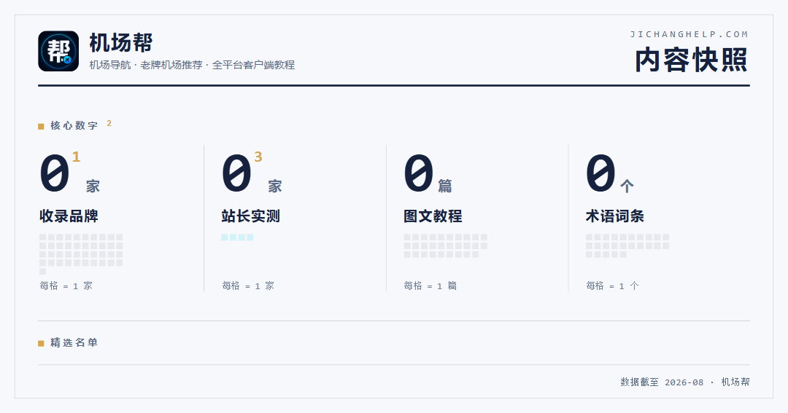
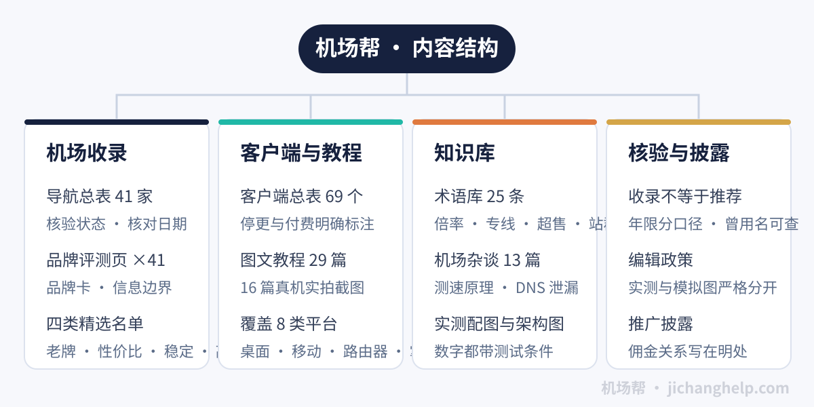

<picture>
<source media="(prefers-color-scheme: dark)" srcset="assets/hero-dark.svg">

</picture>

[进入机场帮](https://www.jichanghelp.com/)　·　[机场导航总表](https://www.jichanghelp.com/airport-navigation/)　·　[客户端与教程](https://www.jichanghelp.com/clients/)　·　[术语库](https://www.jichanghelp.com/glossary/)　·　[机场杂谈](https://www.jichanghelp.com/category/airport-talk/)

机场帮收录并整理各地区机场信息，用统一字段让品牌可以横向比较，并提供全平台客户端下载、订阅使用教程与故障排查方法。所有品牌资料带最后核对日期，实测与模拟演示严格分开，收录不等于推荐。

<table width="100%">
<tr>
<td width="50%" valign="top">

<h3>从这里开始</h3>

<table width="100%">
<tr><td><b>查某家机场靠不靠谱</b> <a href="https://www.jichanghelp.com/airport-navigation/">机场导航总表</a>，41 家每家有独立评测页</td></tr>
<tr><td><b>按需求挑机场</b> <a href="https://www.jichanghelp.com/old-airports/">老牌</a> · <a href="https://www.jichanghelp.com/value-airports/">性价比</a> · <a href="https://www.jichanghelp.com/stable-airports/">稳定</a> · <a href="https://www.jichanghelp.com/premium-airports/">高端</a>，四类各有入选口径</td></tr>
<tr><td><b>第一次配置客户端</b> <a href="https://www.jichanghelp.com/clients/">客户端总表</a>按平台选起点，29 篇教程逐屏截图</td></tr>
<tr><td><b>看不懂某个词</b> <a href="https://www.jichanghelp.com/glossary/">术语库</a>，25 个概念带常见误读与问答</td></tr>
<tr><td><b>想自己会判断</b> <a href="https://www.jichanghelp.com/category/airport-talk/">机场杂谈</a>，测速原理、DNS 泄漏这类方法与原理</td></tr>
</table>

</td>
<td width="50%" valign="top">

<h3>内容仓库</h3>

<table width="100%">
<tr><td><a href="https://github.com/jichanghelp/jichangbang"><b>jichangbang</b></a> 站点总导航，四类精选与教程直达</td></tr>
<tr><td><a href="https://github.com/jichanghelp/airport-list"><b>airport-list</b></a> 41 家收录总表，附品牌卡与核验状态</td></tr>
<tr><td><a href="https://github.com/jichanghelp/client-guides"><b>client-guides</b></a> 29 篇客户端图文教程索引，按 10 类平台分表</td></tr>
<tr><td><a href="https://github.com/jichanghelp/glossary"><b>glossary</b></a> 25 个术语词条全文，一条一文件可直接读</td></tr>
<tr><td><a href="https://github.com/jichanghelp/airport-talk"><b>airport-talk</b></a> 杂谈选文与 DNS 数据流架构图</td></tr>
</table>

</td>
</tr>
<tr>
<td width="50%" valign="top">

<h3>最近在写</h3>

<!-- LATEST:START -->

<b><a href="https://www.jichanghelp.com/articles/single-vs-multi-thread-speedtest/">单线程和多线程测速差在哪，为什么测速好看晚上却卡</a></b> 2026-08-13

<b><a href="https://www.jichanghelp.com/articles/dns-leak-what-isp-sees/">DNS 泄漏时运营商能看到什么，看不到什么</a></b> 2026-08-13

<b><a href="https://www.jichanghelp.com/articles/how-we-verify-brands/">一家机场靠不靠谱，自己能查到哪一步</a></b> 2026-08-13

<!-- LATEST:END -->

每天早上从站点 RSS 自动同步

</td>
<td width="50%" valign="top">

<h3>核验口径</h3>

▸ 品牌年限区分「口径已确认」与「品牌自述」，机房年限不与机场年限合并

▸ 没有可核验独立入口的品牌不放外链

▸ 测速图区分实测与模拟演示，模拟图带明确水印

▸ 部分品牌入口为推广链接，本站可能获得佣金，规则见<a href="https://www.jichanghelp.com/disclosure/">推广披露</a>

完整规则见<a href="https://www.jichanghelp.com/editorial-policy/">编辑政策</a>，内容纠错走<a href="https://www.jichanghelp.com/contact/">联系方式</a>，纠错类邮件优先处理

</td>
</tr>
</table>

## 贡献轨迹

<picture>
<source media="(prefers-color-scheme: dark)" srcset="https://raw.githubusercontent.com/jichanghelp/jichanghelp/output/github-snake-dark.svg">

</picture>

---

机场帮 · <a href="https://www.jichanghelp.com/">jichanghelp.com</a> · 内容与站点同步更新，收录不等于推荐

